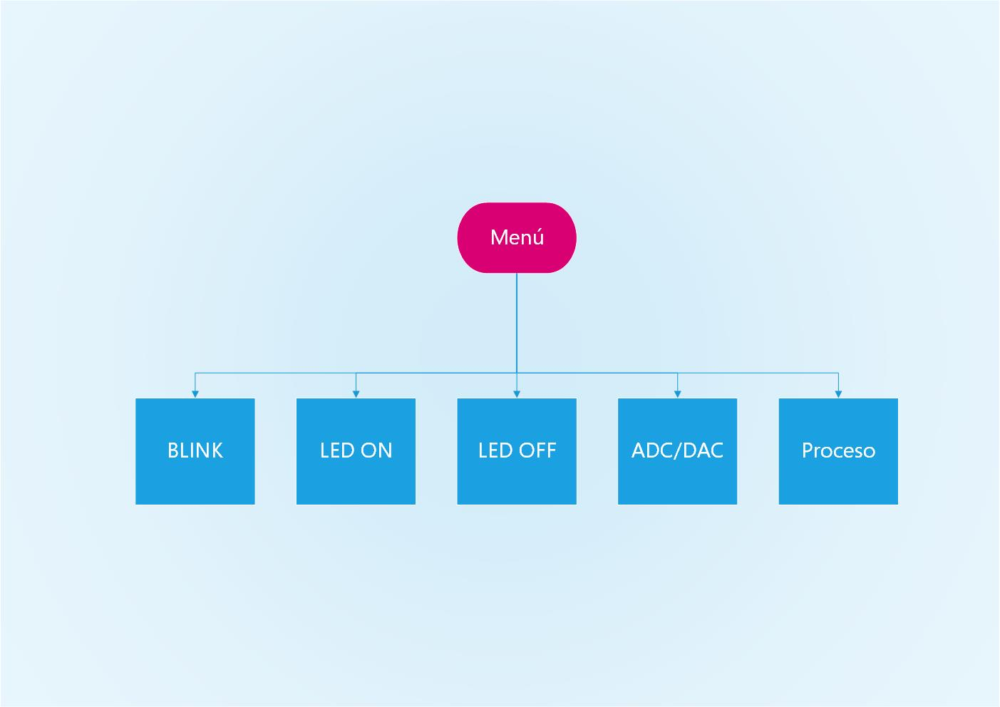
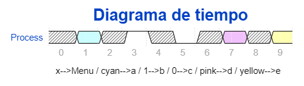

# PRACTICA 1  :  LED BLINK

En esta practica se ha realizado difrentes funcionalidades: 
1. Parpadeo de LED.
2. Encender LED.
3. Apagar LED. 
4. Medir tension de pin y simularla en otro. 
5. Leer la temperatura interna del processador.

Las funcionalidades estan controladas a través de un menú interactivo. 

## CÓDIGO

Para su mejor comprension dividíe el codigo en diferentes partes:

* Cabezera

```cpp

#include <Arduino.h>
#include <driver/dac.h>

int LED=2;

```

* Parpadeo led:

```cpp

void led_blink(){
    Serial.println();

    int i=0;
    while(i<10){

   Serial.println("ON");
  digitalWrite(LED,HIGH);
  delay(500);
  Serial.println("OFF");
  digitalWrite(LED,LOW);
  delay(500);
  i++;
    }   
}

```

* Encendido y apagado de LED.

```cpp
void led_off(){
    Serial.println();

  digitalWrite(LED,LOW);
  Serial.println("LED truned off");
}

void led_on(){
    Serial.println();

  digitalWrite(LED,HIGH);
  Serial.println("LED truned on");
}
```

* Lectura de voltage y salida del mismo.

```cpp
void ad_da_for5secs(){
    Serial.println();

    float measure;
    int ipin= 1;
    

    measure=analogRead(ipin);
    Serial.println(measure);
   
    dac_output_enable(DAC_CHANNEL_1);
    dac_output_voltage(DAC_CHANNEL_1, measure);
    digitalWrite(LED,HIGH); //while the output in "on", led lights on. 
    delay (5000);
    dac_output_voltage(DAC_CHANNEL_1, 0);
    digitalWrite(LED,LOW);
    Serial.write("Ouput set agian to 0V");
    
}
```

* Temperatura: 

```cpp
void temp(){
    Serial.println();
    float T=temperatureRead();
    Serial.print("Temperature with 'temperatureread():' "); 
    Serial.print(T); 
    Serial.println("ºC");

    float T2=hallRead();
    Serial.print("Hall sensor measurement: ");
    Serial.println(T2); 
}
```
* Menú:
```cpp
void menu(){

    if(Serial.available()){
        

        char opc;
        
    
        opc=Serial.read();
        

        if(opc=='a'){
            led_blink();
            }
        else if (opc=='b'){
            led_on();
            }
        else if (opc=='c'){
            led_off();
            }
        else if (opc=='d'){
            // ad_da_for5secs();
            }
        else if (opc=='e'){
            temp();
            }
        else{Serial.println("Option does not match delimiters.");}

        Serial.println();
        Serial.println("Select an opiton: ");
        Serial.println("Option a - LED blink");
        Serial.println("Option b - LED on");
        Serial.println("Option c - LED off");
        Serial.println("Option d - Read Analog Voltage - Set output Voltage");
        Serial.println("Option e - Read MP temperature");

    }
    
}
```

* Cuerpo: 

```cpp
void setup() {

  pinMode(LED,OUTPUT);

  Serial.begin(9600);

        Serial.println("Select an opiton: ");
        Serial.println("Option a - LED blink");
        Serial.println("Option b - LED on");
        Serial.println("Option c - LED off");
        Serial.println("Option d - Read Analog Voltage - Set output Voltage");
        Serial.println("Option e - Read MP temperature");
        Serial.println();
        Serial.println("Pulse letra para continuar. ");
}

void loop() {

    menu();
    

}
```

## Diagrama de flujo



## Diagrama de tiempos

